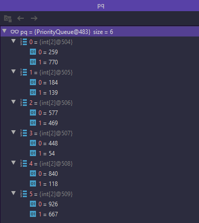

# Approach 1

> TL;DR Sort based on savings


# Why?

Higher the savings, the decision to choose the minimum (lower) cost is high. ` costCityA - costCityB `

A priority queue is used, where the insertion of each element happens based on the above logic in Comparator.

The sorted collection will be in ascending order, most negative to most positive.

So starting from item 1, We can infer that cityB's cost will be higher. And we need minimum, so choosing the cityA's cost for minimizing overall sum.

Now comes the pre condition, N number of candidates to cityA and N number of candidates to cityB.

So while minimizing sum we choose cityA for the first half iteration and then cityB.

Now you would'nt choose 1cityBCost
 

**Example**

For an input array
```
 [[259, 770], 
 [448, 54],
 [926, 667],
 [184, 139],
 [840, 118],
 [577, 469]]
```

The priority queue will hold this after insertion based on the Comparator logic. 
   
Priority Queue iteration ordering



As priorityqueue is based on heap, there is **NO** general ordering during iteration as shown above in screenshot, instead poll method should be used to get the required ascending order.

So the ordering with poll is

```
259, 770
184, 139
577, 469
926, 667
448, 54
840, 118
```

To verify check The difference ( savings ) of each element's cityA with cityB cost,

```
 [-511, 45, 108, 259, 394, 722]
``` 

Finally,
extracting and summing cityA's cost in first half of order with cityB's cost in second half.🚀   

# Approach 2

Explanation - https://leetcode.com/problems/two-city-scheduling/discuss/667786/Java-or-C%2B%2B-or-Python3-or-With-detailed-explanation
