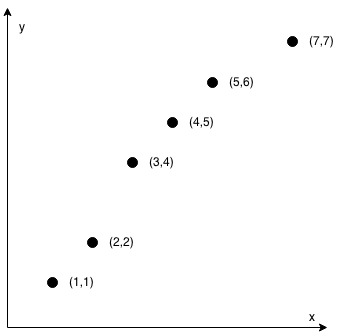

Check If It Is a Straight Line
You are given an array coordinates, coordinates[i] = [x, y], where [x, y] represents the coordinate of a point. Check if these points make a straight line in the XY plane.

**Example 1:**

Input: coordinates = [[1,2],[2,3],[3,4],[4,5],[5,6],[6,7]]

Output: true

________________

**Example 2:**

Input: coordinates = [[1,1],[2,2],[3,4],[4,5],[5,6],[7,7]]
Output: false

________________

Constraints:

`   2 <= coordinates.length <= 1000
    coordinates[i].length == 2
    -10^4 <= coordinates[i][0], coordinates[i][1] <= 10^4
    coordinates contains no duplicate point.`
   
   _Hint #1_  
If there're only 2 points, return true.
   
   _Hint #2_  
Check if all other points lie on the line defined by the first 2 points.
   
   _Hint #3_  
Use cross product to check collinearity.